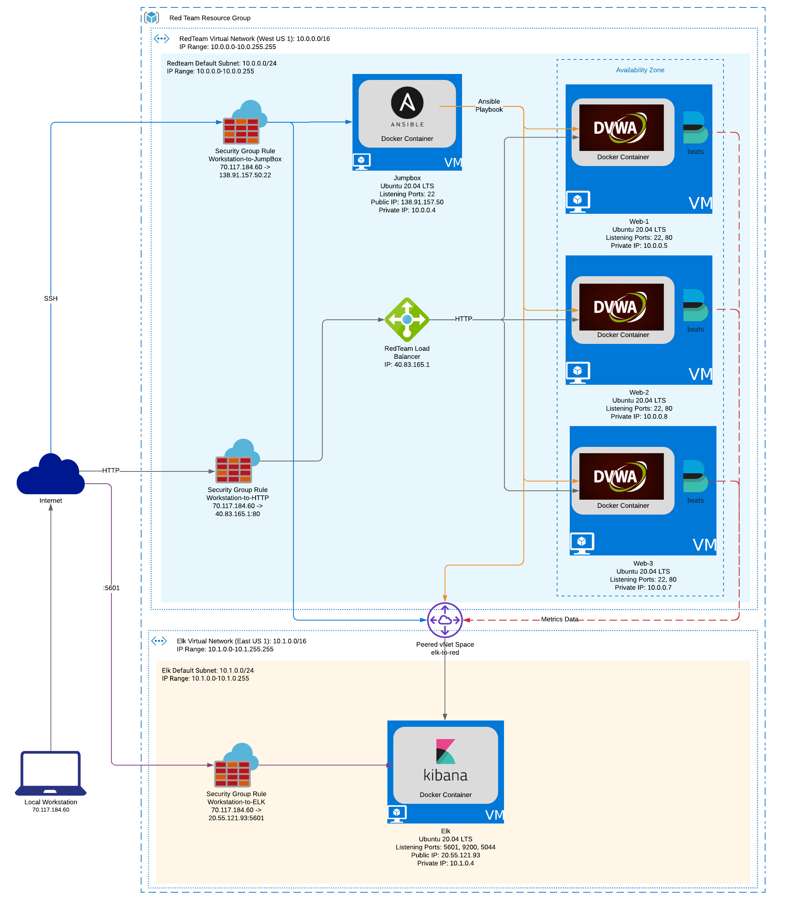

# Automated ELK Stack Deployment

The files in this repository were used to configure the network depicted below.



These files have been tested and used to generate a live ELK deployment on Azure. They can be used to either recreate the entire deployment pictured above. Alternatively, select portions of the playbooks located in the `roles` directory may be used to install only certain pieces of it, such as Filebeat.

This document contains the following details:

- Description of the Topology
- Access Policies
- ELK Configuration
  - Beats in Use
  - Machines Being Monitored
- How to Use the Ansible Build

## Description of the Topology

The main purpose of this network is to expose a load-balanced and monitored instance of DVWA, the D*mn Vulnerable Web Application.

Load balancing ensures that the application will be highly available, in addition to restricting access to the network.

Integrating an ELK server allows users to easily monitor the vulnerable VMs for changes to the file system and system metrics.

The configuration details of each machine may be found below.

| Name     | Function                | IP Address                                 | Operating System |
|----------|-------------------------|--------------------------------------------|------------------|
| Jump Box | Gateway and Provisioner | Public: 138.91.157.50 Private: 10.0.0.4    | Ubuntu 20.05 LTS |
| Web 1    | DVWA Host               | Public (LB): 40.83.165.1 Private: 10.0.0.5 | Ubuntu 20.05 LTS |
| Web 2    | DVWA Host               | Public (LB): 40.83.165.1 Private: 10.0.0.8 | Ubuntu 20.05 LTS |
| Web 3    | DVWA Host               | Public (LB): 40.83.165.1 Private: 10.0.0.7 | Ubuntu 20.05 LTS |
| Elk      | Kibana Host             | Public: 20.55.121.93 Private: 10.1.04      | Ubuntu 20.05 LTS |

## Access Policies

The machines on the internal network are not exposed to the public Internet.

Only the Jump Box and Elk machines can accept connections from the Internet. Access to these machines are only allowed from the following IP addresses:

- 70.117.184.60

Machines within the network can only be accessed by the Local Workstation.

A summary of the access policies in place can be found in the table below.

| Name                   | Publicly Available | Allowed IP Addresses |
|------------------------|--------------------|----------------------|
| Workstation-to-JumpBox | Yes                | 70.117.184.60        |
| Workstation-to-HTTP    | Yes                | 70.117.184.60        |
| Workstation-to-Elk     | Yes                | 70.117.184.60        |

## Elk Configuration

Ansible was used to automate configuration of the ELK machine. No configuration was performed manually, which is advantageous because it expedites the process of implementing new virtual machines.

The playbook implements the following tasks:

- Installs the Docker apt package
- Installs the python3-pip package
- Installs the Docker python module
- Sets the `vm.max_map_count` option in the `sysctl.conf` file to `262144`
- Downloads and launches a docker Elk container

The following screenshot displays the result of running `docker ps` after successfully configuring the ELK instance.

```bash
CONTAINER ID   IMAGE          COMMAND                  CREATED      STATUS         PORTS                                                                              NAMES
c16e215f68bc   sebp/elk:761   "/usr/local/bin/star…"   9 days ago   Up 3 minutes   0.0.0.0:5044->5044/tcp, 0.0.0.0:5601->5601/tcp, 0.0.0.0:9200->9200/tcp, 9300/tcp   elk
```

## Target Machines & Beats

This ELK server is configured to monitor the following machines:

- 10.0.0.5
- 10.0.0.8
- 10.0.0.7

We have installed the following Beats on these machines:

- Filebeat
- Metricbeat

These Beats allow us to collect the following information from each machine:

- **Filebeat**: A lightweight shipper for forwarding and centralizing log data
- **Metricbeat**: Periodically collects metrics from the host operating system and from services running on the server

## Using the Playbook

In order to use the playbook, you will need to have an Ansible control node already configured. Assuming you have such a control node provisioned:

SSH into the control node and follow the steps below:

- Copy the `roles` directory and the `playbook.yml` file to `/etc/ansible`.
  - Run:
  
  ```bash
  cd /etc/ansible
  svn export https://github.com/urfriendglenn/bootcamp-project1.git/trunk/ansible
  ```

- Update the `/etc/ansible/hosts` file to include the IP Addresses of the target Elk server and webservers.
  - Example:
  
  ```bash
  [webservers]

  10.0.0.5 ansible_python_interpreter=/usr/bin/python3
  10.0.0.8 ansible_python_interpreter=/usr/bin/python3
  10.0.0.7 ansible_python_interpreter=/usr/bin/python3

  [elk]
  10.1.0.4 ansible_python_interpreter=/usr/bin/python3
  ```

  > **_NOTE:_** The `webservers` and `elk` host groups must exist for the playbook to function accordingly

- Run the playbook:
  
  ```bash
  cd /etc/ansible
  ansible-playbook playbook.yml
  ```

- Navigate to `http://[elk_ip_addr]:5601/app/kibana` to check that the installation worked as expected
